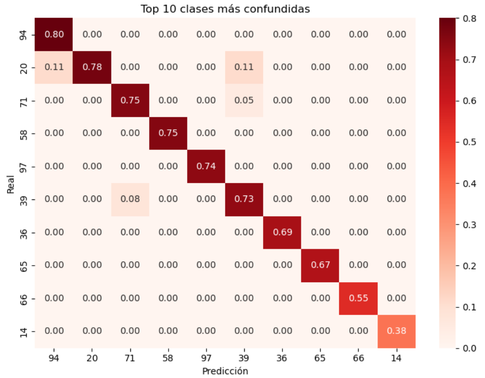
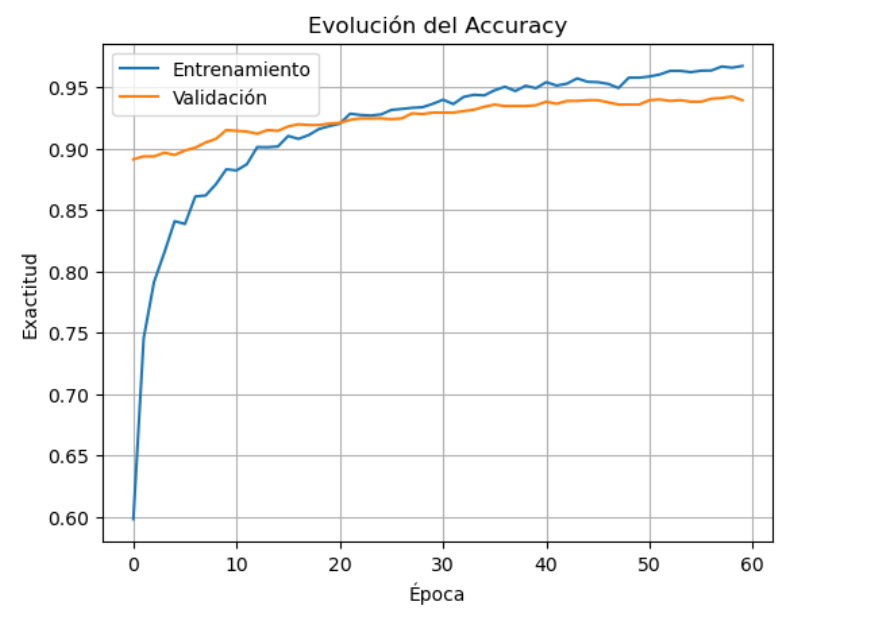

# 🌸 Clasificación Multiclase de Flores con Transfer Learning

Este proyecto implementa un modelo de aprendizaje profundo utilizando **MobileNetV2** preentrenado para la clasificación de imágenes en 102 especies florales distintas, basado en el dataset **Oxford Flowers 102**.

## 🎯 Objetivo

Aplicar la técnica de *Transfer Learning* para construir un sistema eficiente que identifique correctamente flores en imágenes. Se busca optimizar la precisión del modelo manteniendo una arquitectura ligera y eficiente.

## 📁 Dataset

- **Nombre**: Oxford Flowers 102
- **Clases**: 102 tipos distintos de flores.
- **Fuente**: [Oxford Visual Geometry Group](https://www.robots.ox.ac.uk/~vgg/data/flowers/102/)
- **Formato**: Imágenes agrupadas por carpetas de clase.

## 🧠 Modelo

- **Base**: `MobileNetV2` preentrenado en ImageNet.
- **Ajustes**:
  - Congelamiento parcial de capas para preservar conocimiento.
  - Capas densas finales añadidas para adaptación a 102 clases.
  - `ImageDataGenerator` para aumentar datos de entrenamiento.
- **Optimización**:
  - Callbacks: `EarlyStopping`, `ReduceLROnPlateau`, `ModelCheckpoint`.

## 🖼️ Visualizaciones

### 🔍 Matriz de Confusión



### 📈 Evolución de Métricas



## 🧪 Evaluación

El modelo se evaluó usando:

- `Accuracy`
- `Classification Report` (Precision, Recall, F1-score por clase)
- `Conjunto de Prueba`

## 🚀 Cómo Ejecutar

```bash
# Clona el repositorio
git clone https://github.com/tu_usuario/clasificacion-flores-mobilenetv2.git
cd clasificacion-flores-mobilenetv2

# Crea un entorno virtual
python -m venv venv
source venv/bin/activate  # En Windows: venv\Scripts\activate

# Instala las dependencias
pip install -r requirements.txt

# Ejecuta el notebook
jupyter notebook "Multiclasificacion Flores Transfer Learning Version 2-C.ipynb"
